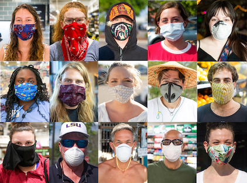

## ds-masters_hack-1

This is hackathon output (MISIS, SkillFactory, 19.10.20 - 24.10.20)

## what the target is?

Nowadays people all over the world wears different types of mask against COVID-19 situation.
Some of them are intended for protection function (we call them OK), but other are not (we call them NG).



So, we collected the bunch of examples and packed it to documented dataset to be used with ML algorithms.
It could be used in projects with raised requirements to types of mask.

Enjoy and wear right one!

## repository structure

```
|- src/         development scripts
|- data/        collected dataset
     |- kids/   photos of kids with OK and NG types of mask
     |- men/    photos of men with OK and NG types of mask
     |- women/  photos of women with OK and NG types of mask
|- spec.json    detailed specification of each photo
```

## specification description

```
"images": [ {
    "path":     relative path to photo
    "format":   photo format
    "height":   photo height in pixels
    "width":    photo width in pixels
    "url":      link to original source
}, ... ]

```
